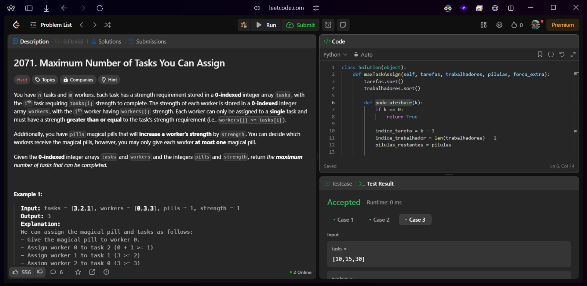
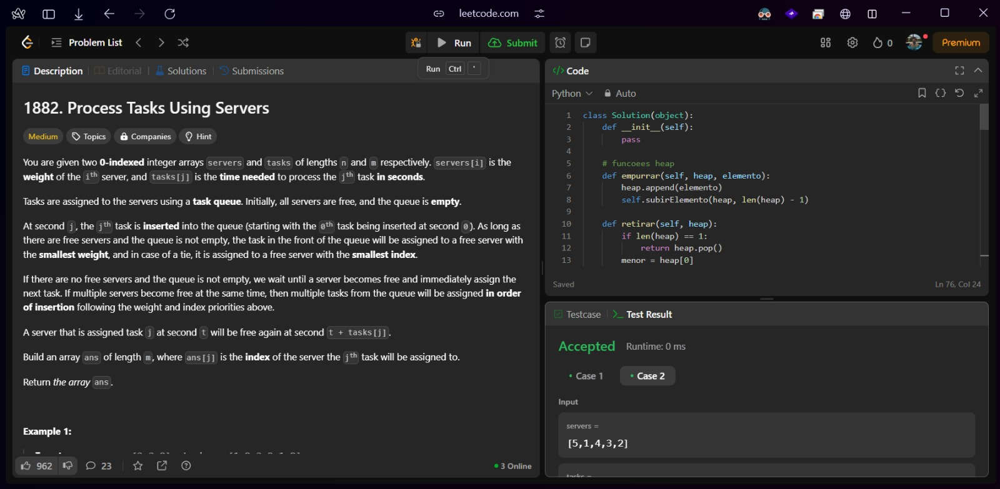

# Greed_DesafiosLeetcode

**Conteúdo da Disciplina**: Algoritmos Ambiciosos 

## Alunos

| Matrícula  | Aluno                       |
| ---------- | --------------------------- |
| 21/1030809 | JULIO CESAR ALMEIDA DOURADO |

## Sobre

Meu projeto foi resolução de problemas do LeetCode.

## Link de apresentação no Youtube

[Clique aqui](https://youtu.be/O1Sr32rIYyQ)

## Screenshots do Projeto em Funcionamento

## Desafios

| NOME                                                                                                              | DIFICULDADE |
| ----------------------------------------------------------------------------------------------------------------- | ----------- |
| [maximum profit in a job scheduling](https://leetcode.com/problems/maximum-profit-in-job-scheduling/description/) | HARD        |
| [maximum number of tasks you can assign](https://leetcode.com/problems/maximum-number-of-tasks-you-can-assign/)   | HARD        |
| [process tasks using servers](https://leetcode.com/problems/process-tasks-using-servers)                          | MEDIUM      |

Aqui estão algumas imagens do projeto em funcionamento:

#### Desafio 1 [1235. Maximum Profit in Job Scheduling(HARD)]()

#### Desafio 2 [2071. Maximum Number of Tasks You Can Assign (HARD)](s)

#### Desafio 3 [1882. Process Tasks Using Servers (MEDIUM)](https://leetcode.com/problems/maximum-number-of-tasks-you-can-assign/)

## Modo de uso

versão do Python: 3.13.0

Para rodar o arquivo manualmente: 
`python nomeDoArquivo.py`
