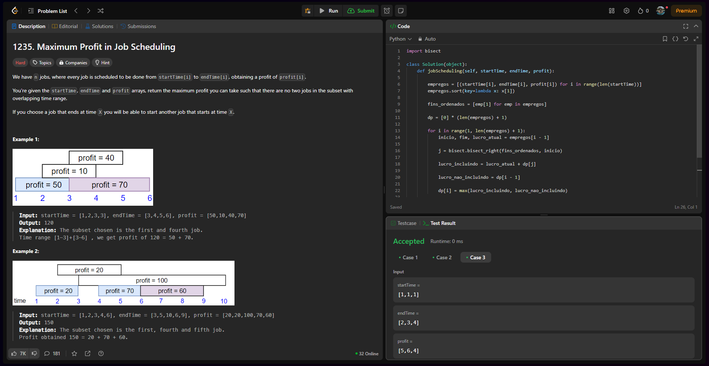

# DividirConquistar_Desafios_LeetCode

**Conteúdo da Disciplina**: Dividir e Conquistar 

## Alunos

| Matrícula  | Aluno                          |
| ---------- | ------------------------------ |
| 21/1030809 | JULIO CESAR ALMEIDA DOURADO    |

## Sobre

Meu projeto foi resolução de problemas do LeetCode.

## Link de apresentação no Youtube
[Clique aqui]() 

## Screenshots do Projeto em Funcionamento

## Desafios
| NOME  | DIFICULDADE |
| ---------- | ------------------------------ |
|[maximum profit in jobs scheduling](https://leetcode.com/problems/maximum-profit-in-job-scheduling/description/)| HARD|
|||
|||

Aqui estão algumas imagens do projeto em funcionamento:

#### Desafio 1 [1235. Maximum Profit in Job Scheduling(HARD)](https://leetcode.com/problems/maximum-profit-in-job-scheduling/description/)

## Modo de uso

versão do Python: 3.13.0

Para rodar o arquivo manualmente: 
`python nomeDoArquivo.py`
